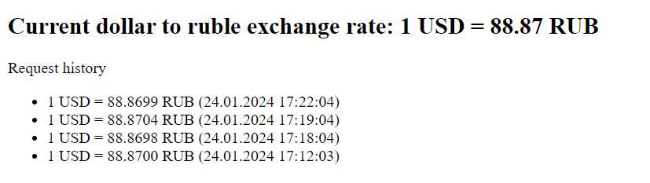

При переходе на /get-current-usd/ сервис возвращает
актуальный курс доллара к рублю, а также историю запросов

#### Для запуска:
1. В файле settings.py заменить зачение переменной API_KEY 
на api-key, полученный через https://apilayer.com/marketplace/exchangerates_data-api

2. Установить необходимые библиотеки
    ```
    pip install -r requirements.txt
    ```

3. Выполнить
    ```
    python manage.py runserver
    ```
4. Перейти на `http://localhost:8000/get-current-usd/`

